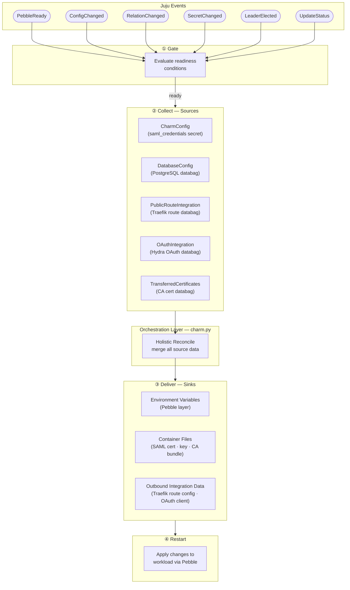

# Architecture — Identity SAML Provider Operator

## Why the Charm Exists

A workload application needs operational context to run: database credentials,
upstream service URLs, TLS material, routing rules. These come from the Juju
model — configs, secrets, integrations — but the workload knows nothing about
Juju. The charm exists to bridge that gap: read state from Juju-managed sources,
transform it, and deliver it in the forms the workload expects.

## The Charm as an Orchestration Layer

The charm contains no business logic. It is a pure **orchestration layer** whose
only job is:

1. Observe Juju events.
2. Read data from **sources**.
3. Push data into **sinks**.

Every event is treated the same way: "something changed → re-read all sources →
reconcile all sinks." This single reconcile path keeps the charm stateless and
predictable.

## Sources and Sinks

- A **source** is anything that supplies state the workload needs: Juju charm
  configs, Juju secrets, Juju integration databags.
- A **sink** is any destination where the workload consumes that state:
  environment variables, configuration files on the container filesystem, or
  outbound integration databags written back to related applications.

The charm's entire runtime behaviour can be described as data flowing from
sources to sinks, triggered by Juju events.

## Decoupling Through Interfaces

Sources and sinks are not accessed directly by the orchestration layer. They are
abstracted behind protocol interfaces so that:

- Adding a new source means implementing the interface and wiring it into the
  orchestration layer.
- Adding a new sink means extending the reconcile step.
- Swapping the backing implementation of any source or sink does not affect the
  orchestration layer.

This makes the charm's architecture open to extension without modifying its core
reconcile logic.

## The Reconcile Cycle

On every Juju event, the orchestration layer runs a single reconcile cycle:

1. **Gate** — evaluate readiness conditions; skip or defer if prerequisites are
   unmet.
2. **Collect** — read all sources and merge their contributions.
3. **Deliver** — push the merged state into all sinks (environment variables,
   files, outbound integration data).
4. **Restart** — apply changes to the workload process only when sink content
   has actually changed.

This uniform cycle means no event-specific branching in the main path — the
charm converges to the correct state regardless of which event triggered it.

## Architecture Overview Diagram

