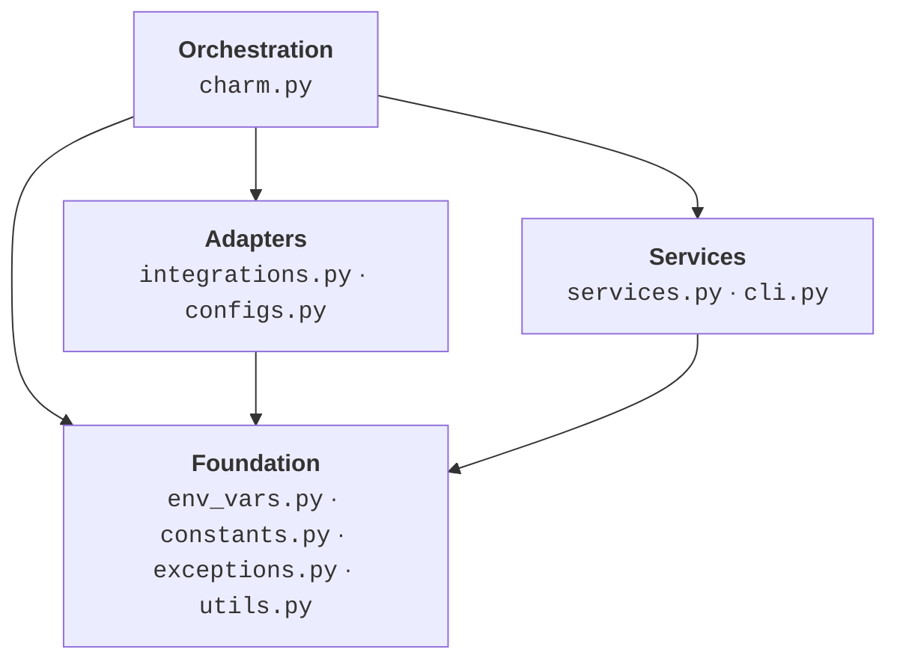
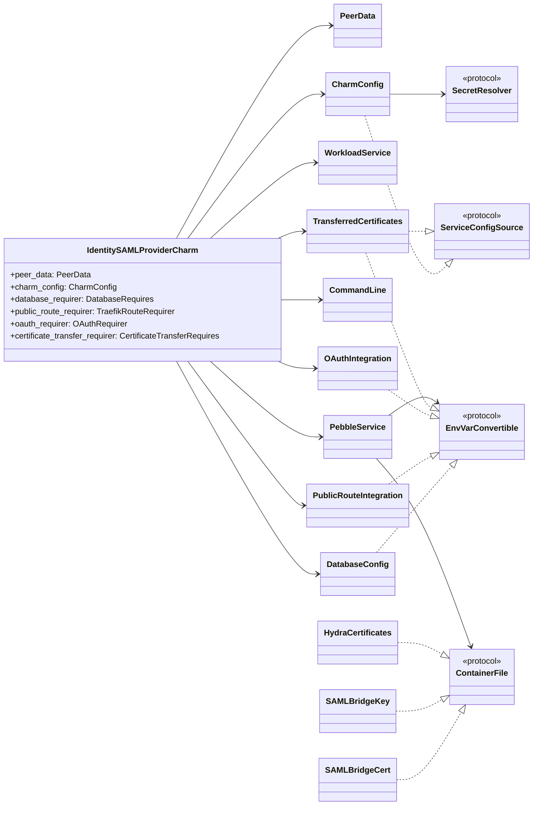

# Design — Identity SAML Provider Operator

## General Design

### Layered Hierarchy

The codebase follows a strict layered architecture. Each layer depends only on
the layers below it. No upward or lateral cross-layer imports are permitted.

- **Orchestration** — event observation, action handling, source→sink wiring.
  Composes adapters and services.
- **Adapters** — transform external Juju data (integrations, configs, secrets)
  into protocol-conforming objects.
- **Services** — interact with the workload container through Pebble (layer
  management, file push, CLI execution).
- **Foundation** — protocol definitions, constants, condition predicates, and
  domain exceptions shared across all layers.

### Encapsulation by Juju Concepts

Modules and classes are organised around Juju's own domain concepts. Each Juju
concept — integrations, configs, secrets, workload containers — maps to a
dedicated module or class that fully encapsulates its access patterns and data
structures. The orchestration layer composes these Juju-concept-aligned
boundaries rather than mixing concerns across them.

### Data Contracts

Layers communicate through explicit data contracts defined as Python `Protocol`
interfaces. The orchestration layer never consumes raw integration data or Juju
config values directly — it receives protocol-conforming objects from the
adapter layer and passes them to the service layer.

| Contract | Direction |
| --- | --- |
| `EnvVarConvertible` | Adapters → Services |
| `ServiceConfigSource` | Adapters → Services |
| `ContainerFile` | Adapters → Services |
| `SecretResolver` | Foundation → Adapters |

These contracts are the only coupling points between layers. Implementations may
change freely provided they satisfy the protocol.

### Holistic Reconciliation

All Juju events converge into a single reconcile path. The handler re-reads all
data sources, re-renders all sinks, and applies the result to the workload. No
event-specific branching exists in the main flow. This guarantees idempotency —
invoking the handler on any event produces a convergent state.

### Protocol-Based Decoupling

Data sources and sinks communicate through `Protocol` interfaces. The
orchestration layer depends only on protocol contracts, not on concrete
implementations. Source adapters expose a uniform interface regardless of
whether the backing data originates from a relation databag, a Juju secret, or a
config option. Sinks accept any protocol-conforming object without knowledge of
its provenance.

## 📋 Module Structure

| Module | Responsibility |
| --- | --- |
| `charm.py` | Orchestration layer — Juju event observation, action handling, source→sink wiring. |
| `integrations.py` | Integration adapters — reading from and writing to Juju relation databags. |
| `configs.py` | Charm config access, Juju secret resolution, container file sink definitions. |
| `services.py` | Workload service lifecycle and Pebble service operations (layer rendering, file push, restart). |
| `env_vars.py` | Environment variable protocol definition and static baseline values. |
| `cli.py` | Workload CLI command execution via Pebble exec. |
| `utils.py` | Readiness condition predicates that gate the reconcile cycle. |
| `constants.py` | Shared literals (ports, paths, integration names). |
| `exceptions.py` | Domain-specific exception hierarchy. |

### Class Topology

## ⚠️ Hard Constraints

- 🚫 `charm.py` must contain **only** Juju event handlers and Juju action
  handlers. No utility functions, no data transformation, no helper methods.
- 🚫 Third-party domain knowledge must not leak into the project. Vendored
  library internals (requirer APIs, databag schemas, library event types) must
  be fully encapsulated within their adapter class. No module outside the
  adapter may import from or depend on a vendored library's internal behaviour.
- ⚠️ Charm class properties must represent logical attributes of the charm unit
  or application. Do not add convenience accessors for data owned by an
  encapsulated class.
- ⚠️ New data sources must implement the relevant protocol and be wired in the
  orchestration layer — never accessed inline.
- ⚠️ New data sinks must be delivered through the reconcile step — never written
  ad-hoc inside an event handler.
