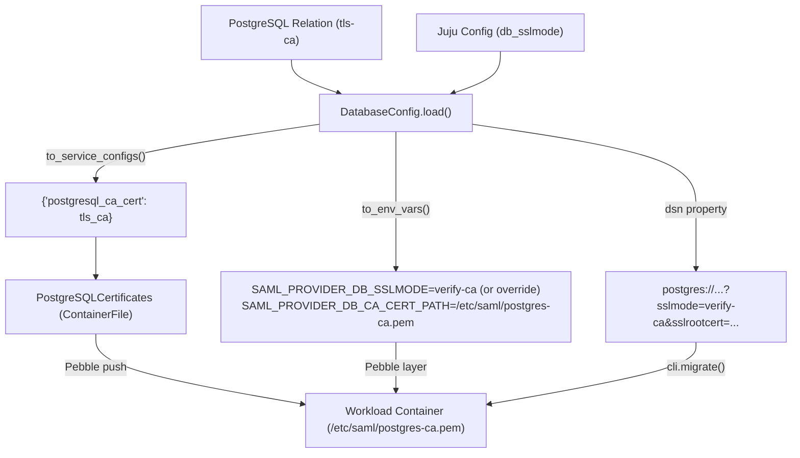

## Context

See `proposal.md` for motivation.

The charm manages configuration files and environment variables for the `identity-saml-provider` workload container. For Hydra CA certificates, the charm uses the `ContainerFile` pattern (`HydraCertificates`) to write `/etc/saml/hydra-ca.pem` and injects `SAML_PROVIDER_HYDRA_CA_CERT_PATH`. The PostgreSQL database relation (`DatabaseRequires`) receives `tls-ca` from TLS-enabled PostgreSQL charms, but currently `DatabaseConfig` ignores this field and hardcodes `sslmode=disable`.

## Goals / Non-Goals

**Goals:**
- Mirror the Hydra CA certificate pattern for PostgreSQL database certificates.
- Write the PostgreSQL CA certificate to `/etc/saml/postgres-ca.pem` inside the workload container when `tls-ca` is present.
- Provide a `db_sslmode` Juju configuration option to allow operators to explicitly override the PostgreSQL SSL mode.
- Default `sslmode` to `verify-ca` when a PostgreSQL TLS CA is provided and `db_sslmode` is empty, or `disable` when absent.
- Ensure 100% backward compatibility for existing deployments without TLS.
- Format the migration DSN with the effective `sslmode` and `sslrootcert=/etc/saml/postgres-ca.pem` when TLS is active.

**Non-Goals:**
- Supporting arbitrary client certificates (mTLS) for database connections.

## Decisions

### Decision 1: Use `PostgreSQLCertificates` ContainerFile Abstraction

- **Rationale**: Keeps file management consistent with `HydraCertificates`, `SAMLBridgeCert`, and `SAMLBridgeKey`. Pebble automatically detects changes and replans/restarts the service when the CA certificate changes.
- **Directory Creation & Permissions**: The file `/etc/saml/postgres-ca.pem` is pushed by Pebble via `Container.push(..., make_dirs=True)`. Pebble creates parent directories (`/etc/saml`) with standard `0755` permissions and the certificate file with `0644` permissions, owned by `root:root`.
- **File Lifecycle & Cleanup**: If `tls-ca` is removed or the database relation is removed, `PostgreSQLCertificates.content` evaluates to `""`. `DatabaseConfig.to_env_vars()` removes `SAML_PROVIDER_DB_CA_CERT_PATH` and sets `SAML_PROVIDER_DB_SSLMODE=disable`. Because the environment variable is unset, the workload stops referencing `/etc/saml/postgres-ca.pem`.

### Decision 2: Default to `verify-ca` with Juju Config `db_sslmode` Override

- **Rationale**: In Juju environments, PostgreSQL charms provide their CA bundle via `tls-ca`. Defaulting to `verify-ca` validates the server certificate against the provided CA bundle automatically without failing on cluster internal DNS/IP mismatches. Exposing `db_sslmode` via charm configuration allows operators to override the SSL mode to `verify-full`, `require`, `prefer`, `allow`, or `disable` when needed for specific operational requirements.
- **Backward Compatibility**: For existing deployments where `tls-ca` is absent and `db_sslmode` is unset, `sslmode=disable` is retained and `SAML_PROVIDER_DB_CA_CERT_PATH` is omitted, preserving exact existing behavior.

### Decision 3: Holistic Event Handling and Timing

- **Timing**: File writes, Pebble layer rendering, and service replanning occur synchronously within the charm's holistic event handler (`_holistic_handler`), which runs on:
  - `pebble_ready` (`identity_saml_provider_pebble_ready`)
  - `config_changed`
  - `database_created`, `database_endpoints_changed`, `database_broken`
  - `start`, `leader_elected`, etc.

## Risks / Trade-offs

- **[Risk]** Workload container does not have the CA cert file written when migration runs.
  → **Mitigation**: `_on_database_created` runs holistic handler and migration execution with the generated DSN pointing to `/etc/saml/postgres-ca.pem`, matching the container file path pushed during planning.
- **[Risk]** Operator configures an invalid `db_sslmode`.
  → **Mitigation**: Charm validates `db_sslmode` against supported PostgreSQL SSL modes (`disable`, `allow`, `prefer`, `require`, `verify-ca`, `verify-full`) and blocks the unit with a clear status message.
